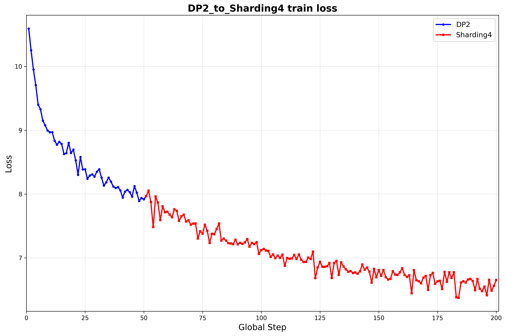
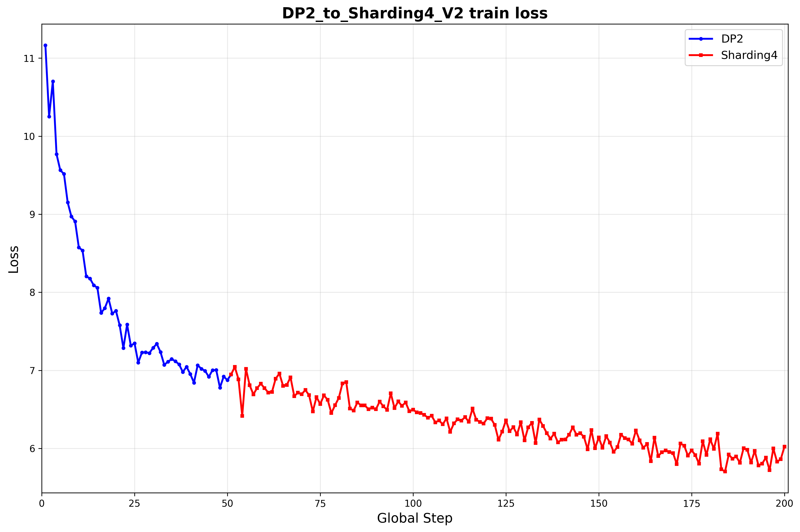
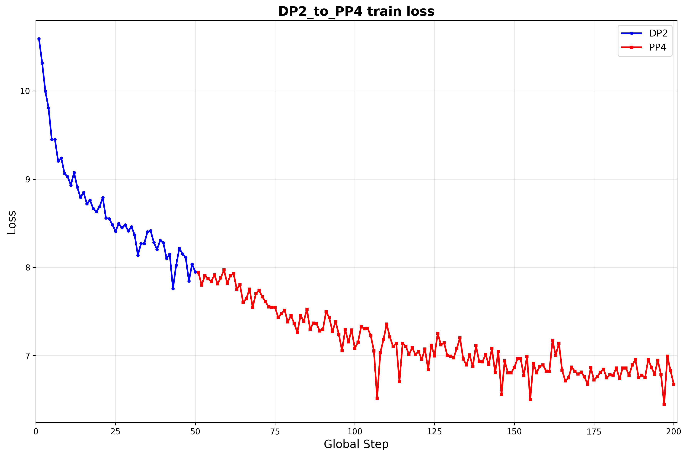
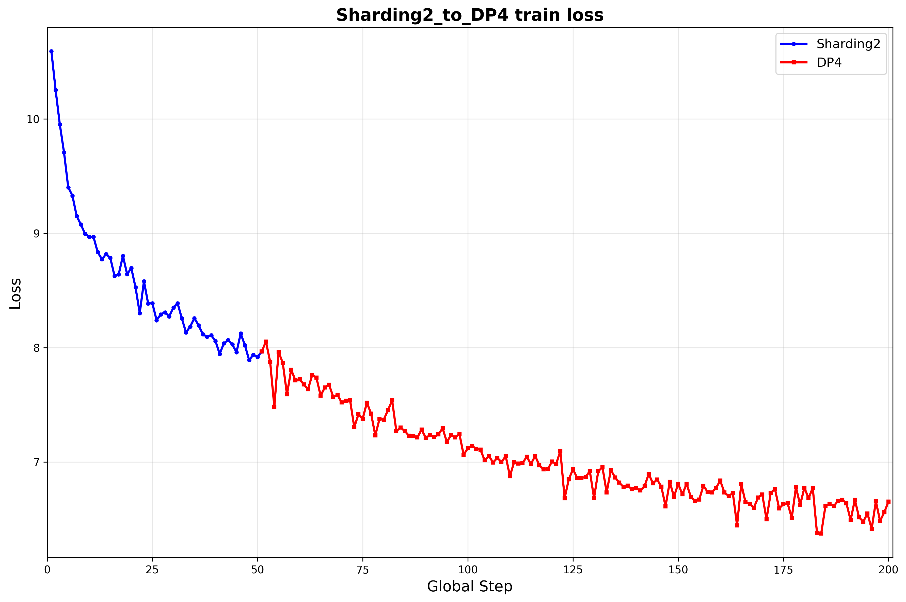
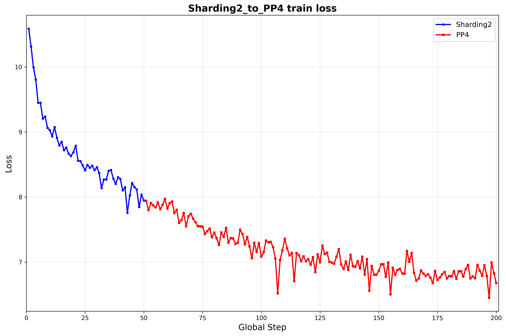
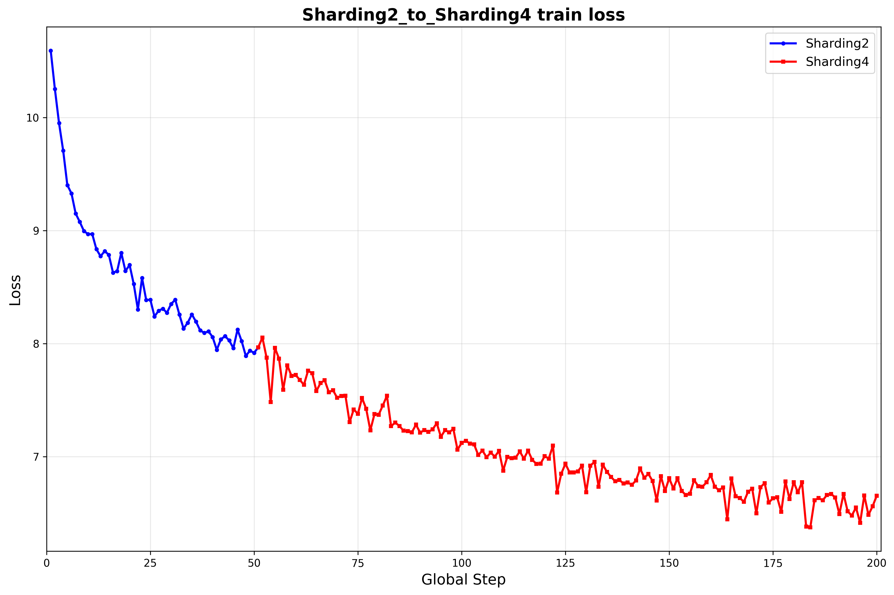

# LLama2

验证方式：

1. ckpt1变换到ckpt2，再变换回ckpt1，md5与原始ckpt对齐，且均可正常训练，loss收敛或逐位对齐
2. ckpt1变换到ckpt2，再分别合成开源格式权重，两份开源权重md5对齐，且均可正常推理，loss逐位对齐

目前先验第一点即可：

loss 收敛趋势图需要用 ckpt1 训 50 个 step， load 成 ckpt 2 继续训 200 个 step，loss 图用不同颜色区分。

* 1e-5 表示：MD5 校验通过，续训的 loss diff 精度误差在 1e-5 以内
*  [✅] 表示：MD5 校验通过，续训的 loss 逐位对齐
* 尝试比较不配置aoa_config的dp2->tp4，接续loss差值在1E-1~1之间

|  | dp4 | sd4(v1) | sd4(v2) | tp4 | pp4 | vpp4 | sd2+tp2 | tp2+pp2 |
| :--- | :--- | :--- | :--- | :--- | :--- | :--- | :--- | :--- |
| dp2 | 1E-5 | 1E-5 | 1E-4 | 1E-5 | 1E-5 | 1E-5 | 1E-5 | 1E-5 |
| sd2 (v1) | 1E-5 | 1E-5 | 1E-4 | 1E-5 | 1E-5 | 1E-5 | 1E-5 | 1E-5 |
| sd2 (v2) | 1E-4 | 1E-4 | 1E-4 | 1E-4 | 1E-4 | 1E-4 | 1E-4 | 1E-4 |
| tp2 | 1E-5 | 1E-5 | 1E-4 | 1E-4 | 1E-4 | 1E-5 | 1E-4 | ✅ |
| pp2 | 1E-5 | 1E-5 | 1E-4 | 1E-4 | ✅ | ✅ | 1E-4 | 1E-4 |
| vpp4 | 1E-5 | 1E-4 | 1E-5 | 1E-5 | ✅ | ✅ | 1E-4 | 1E-4 |
| sd2+tp2 | 1E-5 | 1E-5 | 1E-5 | 1E-4 | 1E-5 | 1E-4 | ✅ | 1E-4 |
| tp2+pp2 | 1E-5 | 1E-5 | 1E-5 | 1E-5 | 1E-5 | 1E-5 | 1E-4 | ✅ |

以下对ShardingV1简称Sharding

## 1. dp2->dp4

验证脚本路径：parallel-strategy-verification/llama2/script/DP2_to_DP4.sh

loss 收敛趋势图：

## 2. dp2->sharding4

验证脚本路径：parallel-strategy-verification/llama2/script/DP2_to_Sharding4_V1.sh

loss 收敛趋势图：

## 3. dp2->sharding4（v2）

验证脚本路径：parallel-strategy-verification/llama2/script/DP2_to_Sharding4_V2.sh

loss 收敛趋势图：

## 4. dp2->pp4

验证脚本路径：parallel-strategy-verification/llama2/script/DP2_to_PP4.sh

loss 收敛趋势图：

## 5. sharding2->dp4

验证脚本路径：parallel-strategy-verification/llama2/script/Sharding2_to_DP4.sh

loss 收敛趋势图：

## 6. sharding2->pp4

验证脚本路径：parallel-strategy-verification/llama2/script/Sharding2_to_PP4.sh

loss 收敛趋势图：

## 7. sharding2->sharding4

验证脚本路径：parallel-strategy-verification/llama2/script/Sharding2_to_Sharding4.sh

loss 收敛趋势图：