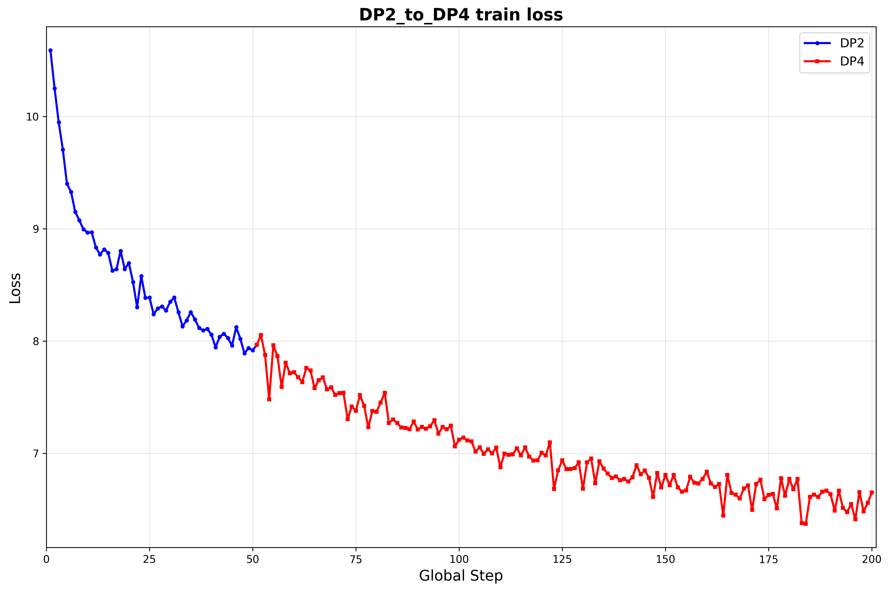

# LLama2

验证方式：

1. ckpt1变换到ckpt2，再变换回ckpt1，md5与原始ckpt对齐，且均可正常训练，loss收敛或逐位对齐
2. ckpt1变换到ckpt2，再分别合成开源格式权重，两份开源权重md5对齐，且均可正常推理，loss逐位对齐

目前先验第一点即可：

loss 收敛趋势图需要用 ckpt1 训 50 个 step， load 成 ckpt 2 继续训 200 个 step，loss 图用不同颜色区分。

|  | dp4 | sharding4 (v1) | sharding4 (v2) | tp4 | pp4 | tp2 + pp2 |
| :--- | :--- | :--- | :--- | :--- | :--- | :--- |
| dp2 | ✅ | ✅ |  |  |  |  |
| sharding2 (v1) |  | ✅ |  |  |  |  |
| sharding2 (v2) |  |  | ✅ |  |  |  |
| tp2 |  |  |  | ✅ |  |  |
| pp2 |  |  |  |  | ✅ |  |
| tp2 + pp2 |  |  |  |  |  | ✅ |

## 1. dp2->dp4

验证脚本路径：

loss 收敛趋势图：

## 2. dp2->sharding4（v1）

验证脚本路径：

loss 收敛趋势图：

## 3. dp2->sharding4（v2）

验证脚本路径：

loss 收敛趋势图：